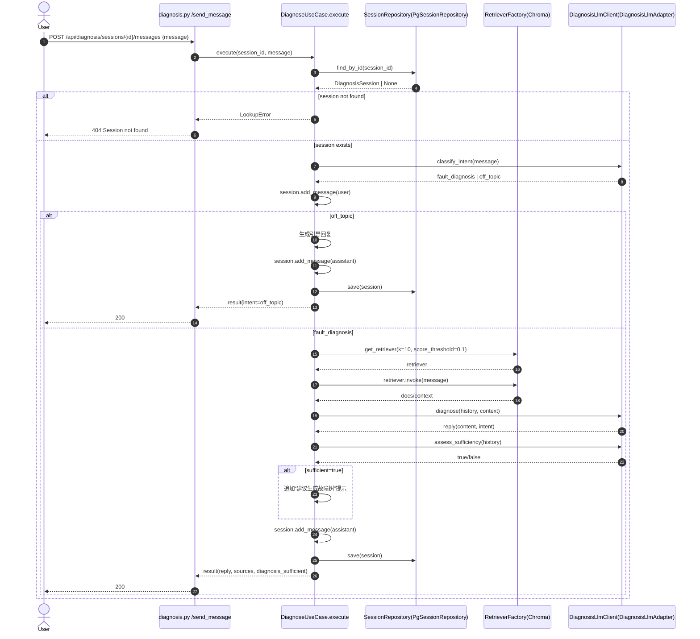
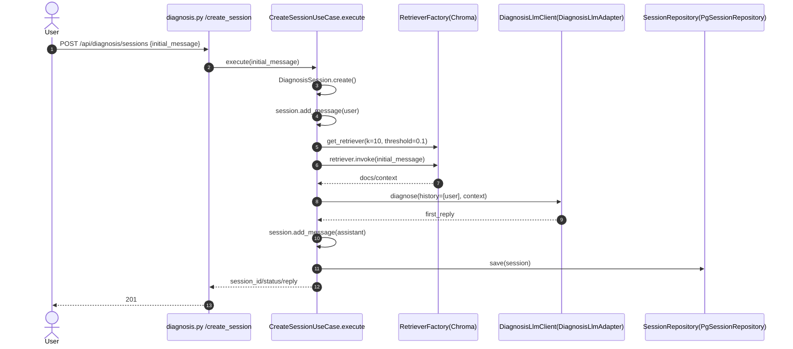

# 诊断对话实现说明（US2）

本文档说明项目中“多轮诊断对话”模块的调用链、时序图，以及各文件/方法职责。

---

## 1. 诊断对话是什么

诊断对话是系统围绕故障问题进行的多轮交互流程，目标是：

1. 基于知识库（向量检索）提供有依据的诊断回复；
2. 识别用户是否跑题（off-topic）；
3. 判断当前信息是否足够生成故障树；
4. 将完整会话历史持久化到 PostgreSQL。

---

## 2. 总体时序图（发送一条诊断消息）

---

## 3. 创建会话时序图（首轮诊断）

---

## 4. 文件与方法职责清单

### 4.1 Web 层（HTTP 入口）

#### `Backend/Web/Endpoints/diagnosis.py`

- `create_blueprint(create_session_use_case, diagnose_use_case, get_session_use_case)`
  - 注册诊断相关 3 个路由。
- `create_session()`
  - 处理 `POST /api/diagnosis/sessions`，调用 `CreateSessionUseCase.execute`。
- `send_message(session_id)`
  - 处理 `POST /api/diagnosis/sessions/{session_id}/messages`，调用 `DiagnoseUseCase.execute`。
- `get_session(session_id)`
  - 处理 `GET /api/diagnosis/sessions/{session_id}`，调用 `GetSessionUseCase.execute`。

> 本层只负责 HTTP 入参/出参与状态码，不包含业务规则。

---

### 4.2 Application 层（业务编排）

#### `Backend/Application/UseCases/create_session_use_case.py`

- `CreateSessionUseCase.execute(initial_message)`
  - 校验输入；
  - 创建会话与用户首条消息；
  - 调用向量检索组装 context；
  - 调用 LLM 生成首轮诊断回复；
  - 保存会话并返回给前端。
- `_retrieve_context(query)`
  - 使用 `RetrieverFactory.get_retriever(...).invoke(query)` 拉取相关文档。

#### `Backend/Application/UseCases/diagnose_use_case.py`

- `DiagnoseUseCase.execute(session_id, message)`
  - 加载会话；
  - 判断会话是否可继续；
  - 进行意图识别（诊断/跑题）；
  - 跑题时返回引导文案；
  - 诊断场景下执行 RAG 检索 + LLM 回复；
  - 评估信息是否充足（`diagnosis_sufficient`）；
  - 持久化会话并返回 sources。
- `_retrieve_context(query)`
  - 检索上下文文本。
- `_get_sources(query)`
  - 检索来源文档摘要，回传给前端。

#### `Backend/Application/UseCases/get_session_use_case.py`

- `GetSessionUseCase.execute(session_id)`
  - 查询会话并返回完整消息历史（用于会话恢复/回放）。

---

### 4.3 Application Interfaces（契约）

#### `Backend/Application/Interfaces/diagnosis_llm_client.py`

- `diagnose(conversation_history, retrieved_context)`
  - 诊断回复生成契约。
- `classify_intent(message)`
  - 意图识别契约：`fault_diagnosis` / `off_topic`。
- `assess_sufficiency(conversation_history)`
  - 信息充分性评估契约。

#### `Backend/Application/Interfaces/session_repository.py`

- `save(session)`
  - 持久化会话及消息。
- `find_by_id(session_id)`
  - 查询会话聚合。

#### `Backend/Application/Interfaces/retriever_repository.py`

- `RetrieverFactory.get_retriever(k, score_threshold)`
  - 创建检索器。
- `Retriever.invoke(query)`
  - 执行语义检索。

---

### 4.4 Infrastructure 层（外部实现）

#### `Backend/Infrastructure/llm/diagnosis_llm_adapter.py`

- `DiagnosisLlmAdapter.diagnose(...)`
  - 基于 Prompt + history + context 生成诊断回复。
- `DiagnosisLlmAdapter.classify_intent(message)`
  - 输出 JSON 分类结果；解析失败默认 `off_topic`。
- `DiagnosisLlmAdapter.assess_sufficiency(history)`
  - 输出 JSON 充分性结果；轮次过少直接 `False`。

#### `Backend/Infrastructure/persistence/pg_session_repository.py`

- `PgSessionRepository.save(session)`
  - 新建或更新会话；消息按追加保存。
- `PgSessionRepository.find_by_id(session_id)`
  - 查询 ORM 并映射回 Domain 实体。
- `_to_model/_message_to_model/_to_entity`
  - Domain ↔ ORM 的数据映射方法。

---

### 4.5 Domain 层（业务状态与不变量）

#### `Backend/Domain/Entities/diagnosis_session.py`

- `DiagnosisSession.create()`
  - 初始化会话（`in_progress`）。
- `DiagnosisSession.add_message(role, content)`
  - 追加消息并刷新 `updated_at`；对非法状态进行约束。
- `DiagnosisSession.transition_to(target)`
  - 按状态机合法迁移。
- `DiagnosisSession.link_fault_tree(fault_tree_id)`
  - 绑定故障树并迁移为 `tree_generated`。

---

## 5. 依赖注入装配点

#### `Backend/Web/app_factory.py`

- 创建并装配：
  - `PgSessionRepository`
  - `DiagnosisLlmAdapter`
  - `CreateSessionUseCase`
  - `DiagnoseUseCase`
  - `GetSessionUseCase`
- 注册 `diagnosis_endpoints` 蓝图。

> 该文件是诊断对话模块的“总入口”，用于把接口实现与用例绑定到 Flask 路由。

---

## 6. 诊断对话输出的关键字段

- `reply.intent`
  - `fault_diagnosis`：正常诊断回复；
  - `off_topic`：非诊断意图；
  - `suggest_fault_tree`：信息充分，建议生成故障树。
- `diagnosis_sufficient`
  - `true/false`，用于前端判断是否展示“生成故障树”操作。
- `sources`
  - 诊断回复引用的文档片段来源。

---

## 7. 一句话总结

诊断对话模块本质是：**会话状态机（Domain） + 用例编排（Application） + 检索增强与LLM推理（Infrastructure） + HTTP适配（Web）** 的闭环。
